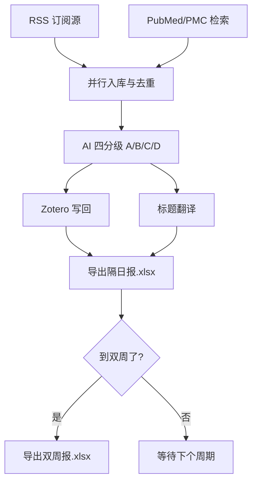
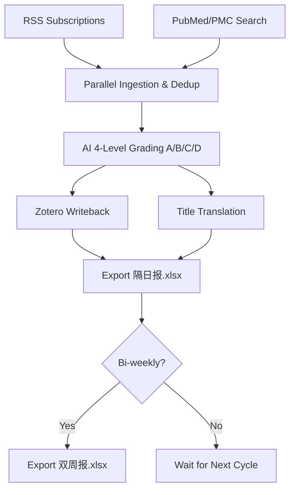

# Zotero Med Pipeline — 医学文献自动化管线

> 让 Zotero + AI 帮你自动发现、筛选、分级、翻译医学文献，每天几分钟，告别手工整理。

基于 [Codex](https://github.com/openai/codex) 构建的医学文献自动化工作流：RSS + PubMed 自动抓取 → AI 分级 → Zotero 写回 → 中文标题翻译 → Excel 报表，全程无需手动翻期刊、筛标题。

[English](#english) | [v1.1 更新内容](#v11-更新内容) | [快速上手](#快速上手6-步) | [配置说明](#配置文件速查表) | [FAQ](#常见问题)

---

## v1.1 更新内容

本次更新让 Zotero Med Pipeline 从一个"能用"的工具，进化成了一个"越用越聪明"的智能文献助手。

**最大的变化：双重学习机制**

以前你只能在 Excel 里标 keep/drop 来教它，现在你还可以直接在 screening_standards.docx 里用中文写你的想法——比如"以后少推荐这类文献"、"这个方向要重点关注"——LLM 会理解你的意思，自动生成规则修改建议，更新筛选标准和 PubMed 搜索关键词。

这意味着你可以用自然语言训练你的文献筛选器，而不需要手动编辑 JSON 或 Markdown 配置文件。

### 新功能

- **智能偏好学习** — LLM 理解你在 docx 评价区写的中文意见，自动生成规则修改建议，更新 screening_standards.md 和 PubMed 检索关键词
- **筛选标准管理系统** — screening_standards.md 自动生成、规则建议表、变更追踪，所有修改都有据可查
- **增强分级引擎** — 新增硬排除规则、更多关键词维度、期刊白名单，分级更精准
- **写回池去重** — 自动检测 Zotero 中已有的条目，避免重复写入
- **偏好学习审计** — 完整的证据链追踪，每次学习都记录在 preference_learning_audit.json 中

### 改进

- 流水线编排增强，Stage1 学习门禁更严格
- MCP 就绪检查集成，Stage 2/3 前自动验证 Zotero 连接
- 翻译配置更灵活，支持更多 OpenAI 兼容接口
- 报表导出更稳定，新增导出方法审计

### 配置变化

- 新增 config/preference_learning.config.json — 偏好学习 LLM 配置
- 新增 prompts/preference_learning.md — 偏好学习提示词模板
- 新增 screening_standards.md — 筛选标准主文件（首次运行自动创建）
- 更新 config/workflow_rules.json — 新增硬排除规则和期刊白名单

---

## 📖 这是什么？

### 为什么要做这个

作为一个医学研究者，每周都要花大量时间做同一件事：

- 打开一堆综合性期刊（Nature、Science、Cell……），在一堆物理、化学、天文文章里翻找医学相关的研究
- 即使在医学期刊里，和自己细分方向真正相关的也就一小部分，大部分一眼扫过就关了
- 手动检索 PubMed、逐个看标题摘要、判断要不要精读——重复、枯燥、低效

于是有了这个项目。

### 怎么做的

设计思路和管线逻辑由我构思，具体代码由 [Codex](https://github.com/openai/codex) 生成——一个医学研究者 + AI 编程助手的协作产物。

### 能做什么

**Zotero Med Pipeline** 自动完成从文献发现到整理的全流程：

```text
RSS 订阅 / PubMed 检索  →  去重合并  →  AI 分级(A/B/C/D)  →  写回 Zotero  →  标题翻译  →  导出 Excel 报表
```

每天打开 Codex 说一句话，它自动跑完整条管线，你只需要打开 Excel 看结果。

### 有什么优势

- **不用再翻期刊目录** — RSS 自动抓取，PubMed 定时检索，文献自己找上门
- **不用再逐个筛标题** — AI 按你的研究方向自动分 A/B/C/D 四级，重点看 A 和 B
- **越用越懂你** — 在 Excel 里标 keep/drop/upgrade/downgrade，它会学习你的偏好，下次搜得更准
- **会理解你的评价** — 在 screening_standards.docx 里写中文意见，LLM 会自动帮你修改筛选规则
- **和 Zotero 无缝衔接** — 分级结果直接写入 Zotero，归类到每日收藏夹，PDF 拖进去就能读
- **中文标题一目了然** — A/B/C 级文献自动翻译中文标题，浏览效率翻倍

---

## ✨ 核心特色

- **四阶段管线** — 入库 → 写回 Zotero → 翻译回填 → 报表导出，每阶段有严格的门禁检查
- **双重学习机制** — Excel 反馈（规则引擎）+ docx 评价（LLM 理解），两种方式互补
- **智能偏好学习** — LLM 理解你在 docx 评价区写的中文意见，自动生成规则修改建议
- **筛选标准管理** — screening_standards.md 自动生成、规则建议表、变更追踪
- **增强分级引擎** — 硬排除规则、多关键词维度、期刊白名单
- **写回池去重** — 避免重复写入 Zotero，自动检测已有条目
- **偏好学习审计** — 完整的证据链追踪，每次学习都有据可查
- **Zotero 无缝集成** — 通过 Zotero MCP 插件自动创建文献条目、归类到每日收藏夹
- **隔日自动报表** — 每两天出一份 隔日报.xlsx，A/B/C 三级文献一目了然
- **双周综合报表** — 每两周出一份 双周报.xlsx，方便回顾趋势
- **标题自动翻译** — A/B/C 级文献自动翻译成中文标题，方便中文用户快速浏览
---

## 🧩 六个 Skill

| Skill | 作用 | 一句话说明 |
|---|---|---|
| med-stage-orchestrator | 四阶段编排 | 保证 Stage1→2→3→4 顺序执行，上游失败则下游不跑 |
| med-entry-parallel | 并行入库 | RSS + PubMed/PMC 同时拉取，合并去重 |
| med-query-learning | 反馈学习 | 从上一期 Excel 反馈和 docx 评价中学习，调整搜索策略 |
| med-daily-triage | 每日分级 | 将文献分为 A/B/C/D 四级，生成 Excel 报表 |
| med-zotero-bridge | Zotero 桥接 | 把分级结果写入 Zotero，创建每日收藏夹 |
| med-weekly-synthesis | 周报综合 | 汇总双周数据，生成趋势报表 |

---

## 🏗️ 数据流全景



---

## 📋 你需要准备什么

### 必须有的（没有跑不了）

| 配置 | 说明 |
|---|---|
| **Node.js 18+** | 运行管线脚本 |
| **PowerShell 7 (pwsh) ≥ 7.0.0** | 脚本执行环境（不是 Windows 自带的 5.1！） |
| **Zotero 7.x** | 文献管理器 |
| **Zotero MCP 插件** | 让 Codex 能读写 Zotero（必备！Stage 2/3 依赖） |
| **Codex 桌面版** | 运行 Skills 和 MCP 的宿主环境 |
| **RSS 源或 PubMed 搜索词** | 至少配一个文献来源（config/rss_sources.json 或 config/pubmed_pmc_search.json） |
| **screening_standards.md** | 筛选标准（首次运行自动创建，建议手动定制） |

### 建议配置（不配也能跑，但功能受限）

| 配置 | 不配会怎样 |
|---|---|
| TITLE_TRANSLATION_API_KEY | A/B/C 级文献不翻译中文标题，Excel 里只显示英文 |
| PREFERENCE_LEARNING_API_KEY | screening_standards.docx 评价区的反馈不会被 LLM 自动处理为规则修改；Excel 反馈的规则引擎学习仍正常 |
| config/workflow_rules.json | 需 AI 或手动填写关键词和期刊（见第 4 步） |

### 可选微调（有默认值，一般不用改）

| 配置 | 默认值 |
|---|---|
| ZOTERO_MCP_URL | http://127.0.0.1:23120/mcp |
| ZOTERO_EXE | D:/Zotero/zotero.exe |
| PWSH_PATH | pwsh |
| config/title_translation.config.json | 见文件内注释 |
| config/preference_learning.config.json | 见文件内注释 |

---

## 快速上手（6 步）

### 第 1 步：下载项目

```bash
git clone https://github.com/Chip-G0202/zotero-med-pipeline.git
cd zotero-med-pipeline
```

### 第 2 步：安装依赖环境

**Node.js**（如未安装）：去 [nodejs.org](https://nodejs.org) 下载 LTS 版本，安装后验证：

```bash
node --version   # 应 ≥ v18
```

**PowerShell 7**（如未安装）：去 [GitHub Releases](https://github.com/PowerShell/PowerShell/releases) 下载安装，安装后验证：

```bash
pwsh --version   # 应 ≥ 7.0.0
```

> ⚠️ **重要**：PowerShell 必须是 7.x，不是 Windows 自带的 5.1 版本。

**Zotero 7.x**：去 [zotero.org](https://www.zotero.org/) 下载安装。

**Zotero MCP 插件**：参考 [cookjohn/zotero-mcp](https://github.com/cookjohn/zotero-mcp) 的安装说明。该插件通过 MCP 协议让 Codex 能读写 Zotero，依赖本地 Ollama 运行嵌入模型。

### 第 3 步：配置环境变量

```bash
copy .env.example .env
```

然后用记事本打开 .env，填入你自己的配置：

```ini
# ── 必填 ──────────────────────────────────────────────
# 标题翻译 API（可选，不填则跳过翻译，用英文标题）
TITLE_TRANSLATION_API_KEY=你的翻译API密钥

# ── Zotero 连接（通常不需要改）──────────────────────
ZOTERO_MCP_URL=http://127.0.0.1:23120/mcp
ZOTERO_EXE=D:/Zotero/zotero.exe

# ── 偏好学习 LLM（可选，不填则回退到翻译 key）────────
# PREFERENCE_LEARNING_API_KEY=你的偏好学习API密钥

# ── 其他（一般不用改）────────────────────────────────
# PWSH_PATH=pwsh
# FORCE_RESEARCH_OS_RUN=true  # 设为 true 可强制立即运行，无视间隔
```

**各变量说明：**

| 变量名 | 必填 | 说明 |
|---|---|---|
| TITLE_TRANSLATION_API_KEY | 可选 | 标题翻译 API 密钥（OpenAI 兼容接口）。不填则跳过翻译，用英文标题 |
| PREFERENCE_LEARNING_API_KEY | 可选 | 偏好学习 LLM API 密钥。不填则回退到翻译 key。两个都不填则 docx 评价区的反馈不会被自动处理 |
| ZOTERO_MCP_URL | 可选 | Zotero MCP 地址，默认 http://127.0.0.1:23120/mcp |
| ZOTERO_EXE | 可选 | Zotero 可执行文件路径，默认 D:/Zotero/zotero.exe |
| PWSH_PATH | 可选 | PowerShell 7 路径，默认 pwsh |
| FORCE_RESEARCH_OS_RUN | 可选 | 设为 	rue 可强制立即运行，无视 2 天间隔 |


### 第 4 步：配置搜索源和筛选标准

> 🤖 **AI 辅助配置（手动配置较复杂，强烈建议AI辅助配置）**：
> 下面的 `config/workflow_rules.json`、`screening_standards.md`、`config/pubmed_pmc_search.json` 配置较复杂，建议在 Codex 中直接让 AI 帮你生成。
> 复制以下提示词并替换 `[你的研究方向]` 即可：
>
> ```
> 请根据我的研究方向帮我配置 Zotero Med Pipeline 的配置文件。
> 我的研究方向是：[你的研究方向，例如：环境污染物（如微塑料、PFAS）对神经系统发育的毒性机制]
>
> 请帮我：
> 1. 填写 config/workflow_rules.json 中的 terms.pollutant、terms.core_topic、terms.mechanism、journal_whitelist 和 grade_reasons
> 2. 填写 screening_standards.md 中的优先关注、相对降权和严格排除规则
> 3. 填写 config/pubmed_pmc_search.json 中的 keyword_groups
>
> 不要修改 feedback_learning 部分和 weights/thresholds 的默认值。
> ```

#### 4.1 RSS 订阅源（`config/rss_sources.json`）

把你关注的期刊 RSS 地址填进去：

```json
{
  "sources": [
    {
      "name": "Nature Medicine",
      "url": "https://www.nature.com/nm.rss",
      "enabled": true
    },
    {
      "name": "The Lancet",
      "url": "https://www.thelancet.com/rssfeed/lancet_current.xml",
      "enabled": true
    }
  ]
}
```

**字段说明：**
- `name`：期刊名称（随便写，用于显示）
- `url`：RSS 订阅地址（在期刊官网找 RSS 图标，右键复制链接）
- `enabled`：`true` = 启用，`false` = 暂时停用

**如何找 RSS 地址？**
1. 打开期刊官网
2. 找 RSS 图标（橙色方块）或搜索 "RSS"
3. 右键复制链接地址
4. 粘贴到 `url` 字段

#### 4.2 PubMed 搜索策略（`config/pubmed_pmc_search.json`）

配置你的 PubMed 搜索关键词：

```json
{
  "days_back": 7,
  "retmax": 300,
  "query": "",
  "keyword_groups": {
    "required": [
      ["diabetes", "diabetic"],
      ["kidney", "renal"]
    ],
    "optional": [
      ["biomarker", "biomarkers"],
      ["clinical trial"
    ],
    "negative": [
      "case report"
    ]
  }
}
```

**字段说明：**
- `days_back`：搜索最近几天的文献（默认 7）
- `retmax`：最多返回多少条（默认 300）
- `query`：直接写 PubMed 搜索式（如果填了，keyword_groups 会被忽略）
- `keyword_groups.required`：必须包含的关键词（每组内是 OR 关系，组间是 AND 关系）
- `keyword_groups.optional`：可选关键词（包含则加分）
- `keyword_groups.negative`：排除的关键词

**如何写 PubMed 搜索式？**
1. 去 [PubMed](https://pubmed.ncbi.nlm.nih.gov/)
2. 在搜索框输入关键词测试
3. 找到满意的搜索式后，点 "Advanced" 查看完整表达式
4. 复制到 `query` 字段


#### 4.3 筛选标准（`screening_standards.md`）

这是你的核心筛选规则文件，管线会根据这里的规则对文献进行 A/B/C/D 分级。

**文件结构：**
- `## 优先关注`：你最关注的研究方向（每条以 `*` 开头）
- `## 相对降权`：你想降低优先级的研究类型
- `## 严格排除`：直接排除的规则
- `## 不确定边界`：反馈中存在冲突的边界情况

**填写示例：**
```markdown
## 优先关注

* 优先关注与 [你的研究方向] 相关的临床研究和基础研究。
* 优先关注随机对照试验和高质量队列研究。
* 优先关注有明确生物标志物或分子机制的研究。

## 相对降权

* 降权样本量过小或缺乏对照组的研究。
* 降权纯描述性、无机制探索的病例报告。
* 降权与临床转化距离较远的纯基础研究。

## 严格排除

* 排除与医学完全无关的研究（如纯物理、纯工程）。
* 排除没有实质性医学洞见的方法学论文。
```

> 💡 **提示**：首次运行时如果 `screening_standards.md` 不存在，管线会自动创建一个默认版本。**强烈建议手动定制以适应你的研究方向**——这是影响分级质量最核心的配置文件。

#### 4.4 分级规则（`config/workflow_rules.json`）

定义 A/B/C/D 四级的关键词权重和阈值。

**需要修改的部分：**
- `terms.pollutant`：你的研究关注的暴露因素关键词
- `terms.core_topic`：你的核心研究方向关键词
- `journal_whitelist`：你关注的期刊列表

**其他字段（一般不用改）：**
- `weights`：各关键词维度的权重
- `thresholds`：A/B/C/D 四级的分数阈值

> 💡 **提示**：`workflow_rules.json` 直接决定分级质量，**请务必根据你的研究方向修改关键词和期刊白名单**。

#### 4.5 翻译配置（`config/title_translation.config.json`）

翻译 API 的参数配置，一般使用默认值即可：

```json
{
  "model": "your-model-name",
  "temperature": 0.2,
  "batch_size": 10,
  "fallback_to_english": true
}
```

**可调参数：**
- `model`：翻译模型名称（填你使用的模型）
- `batch_size`：每批翻译多少条（越大越快，但 API 压力越大）
- `fallback_to_english`：翻译失败时是否用英文标题兜底（建议保持 `true`）

#### 4.6 偏好学习配置（`config/preference_learning.config.json`）

LLM 偏好学习的参数配置，一般使用默认值即可：

```json
{
  "model": "your-model-name",
  "temperature": 0.2,
  "max_retries": 2,
  "prompt_file": "prompts/preference_learning.md"
}
```

**可调参数：**
- `model`：偏好学习模型名称（填你使用的模型）
- `temperature`：生成温度（越低越保守，越高越随机）
- `max_retries`：失败重试次数

### 第 5 步：首次运行

1. 打开 Codex 桌面版
2. 把这个项目文件夹拖入 Codex 工作区
3. 对 Codex 说：**"运行医学文献管线"**

Codex 会自动按顺序执行所有阶段，并在 `research_os/文献评价/` 下生成 `隔日报.xlsx`。

### 第 6 步：配置自动化运行

管线内置了 2 天间隔门禁（默认每 2 天运行一次）。你可以通过 Codex 的自动化功能设置定时任务，让它自动运行。

**方式一：在 Codex 中设置 Automation**

对 Codex 说：

```
帮我设置一个自动化任务，每 2 天运行一次医学文献管线。
```

Codex 会调用 `automation_update` 工具创建一个 cron 自动化任务，定时执行管线。

**方式二：手动创建自动化**

在 Codex 的 Automation 面板中：
1. 点击 "Create Automation"
2. 设置名称（如 "医学文献管线"）
3. 设置调度（如 `FREQ=DAILY;INTERVAL=2` 表示每 2 天）
4. 设置工作目录为项目根目录
5. 设置 prompt 为 `"运行医学文献管线"`

**关于间隔门禁：**
- 默认每 2 天运行一次（`RESEARCH_OS_RUN_INTERVAL_DAYS=2`）
- 如果不到 2 天就运行，管线会跳过并输出 skip 报告
- 要强制立即运行，在 `.env` 中设置 `FORCE_RESEARCH_OS_RUN=true`
- 双周报每 14 天生成一次（`RESEARCH_OS_SYNTHESIS_INTERVAL_DAYS=14`）


---

## 配置文件速查表

| 文件 | 作用 | 必填 | 默认值 |
|---|---|---|---|
| `.env` | 环境变量（API 密钥、路径） | 建议创建 | 见 `.env.example` |
| `config/rss_sources.json` | RSS 订阅源 | 至少配一个来源 | 空列表 |
| `config/pubmed_pmc_search.json` | PubMed 搜索策略 | 至少配一个来源 | 空查询 |
| `screening_standards.md` | 筛选标准 | 建议定制 | 首次运行自动创建 |
| `config/workflow_rules.json` | 分级规则 | 建议修改关键词 | 需 AI 或手动配置 |
| `config/title_translation.config.json` | 翻译配置 | 可选 | 见文件内注释 |
| `config/preference_learning.config.json` | 偏好学习配置 | 可选 | 见文件内注释 |

---

## 📁 目录结构

```
zotero-med-pipeline/
├── README.md                    ← 📖 你正在看的文件
├── LICENSE                      ← 📜 MIT 开源许可证
├── AGENTS.md                    ← 📋 Codex Agent 工作流说明书
├── .env.example                 ← 🔧 环境变量模板
├── .gitignore
├── screening_standards.md       ← 📝 筛选标准（核心配置）
├── config/                      ← ⚙️ 你的配置文件放这里
│   ├── rss_sources.json         ← RSS 订阅源
│   ├── pubmed_pmc_search.json   ← PubMed 搜索策略
│   ├── workflow_rules.json      ← 分级规则
│   ├── title_translation.config.json  ← 翻译配置
│   ├── preference_learning.config.json  ← 偏好学习配置
│   └── README.md                ← 配置说明
├── prompts/
│   ├── title_translation.md     ← 翻译提示词模板
│   └── preference_learning.md   ← 偏好学习提示词模板
├── docs/
│   └── med-skill-alignment.md   ← 技能对齐文档
└── tools/                       ← 🔨 核心脚本
    ├── run_zotero_literature_filter.mjs  ← 主入口
    ├── run_research_os_pipeline.mjs      ← 流水线主脚本
    ├── mcp_bulk_writeback.mjs            ← Zotero 批量写回
    ├── mcp_translation_backfill.mjs      ← 标题翻译
    ├── finalize_research_os_exports.mjs  ← 报表导出
    ├── archive_history_by_feedback.mjs   ← 历史反馈归档
    └── lib/                      ← 底层库
        ├── triage_policy.mjs            ← 分级策略引擎
        ├── screening_standards_file.mjs ← 筛选标准管理
        ├── preference_learning_support.mjs  ← 偏好学习
        └── ...                          ← 其他工具库
```

---

## 常见问题

### Q: 我没有翻译 API key 怎么办？

标题翻译需要一个大模型 API（OpenAI / Anthropic / 其他兼容接口）。如果暂时不想配置，在 `.env` 里不填 `TITLE_TRANSLATION_API_KEY`，管线会自动跳过翻译步骤，Excel 里只显示英文标题。

### Q: 我没有偏好学习 API key 怎么办？

偏好学习需要一个 LLM API 来理解你在 docx 评价区写的中文意见。如果暂时不配置：
- Excel 反馈（keep/drop/upgrade/downgrade）的规则引擎学习仍然正常工作
- docx 评价区的反馈不会被自动处理，但你可以手动修改 `screening_standards.md`

### Q: 两个 API key 有什么区别？

| API Key | 用途 | 不配的影响 |
|---|---|---|
| `TITLE_TRANSLATION_API_KEY` | 翻译英文标题为中文 | 不翻译，用英文标题 |
| `PREFERENCE_LEARNING_API_KEY` | LLM 理解 docx 评价，自动修改规则 | docx 评价不自动处理，Excel 反馈仍正常 |

如果只配一个，建议配 `TITLE_TRANSLATION_API_KEY`，它会自动作为偏好学习的备用 key。

### Q: Zotero MCP 插件怎么装？

参考 [cookjohn/zotero-mcp](https://github.com/cookjohn/zotero-mcp) 的 README 安装说明。该插件通过 MCP 协议让 Codex 能读写 Zotero，依赖本地 Ollama 运行嵌入模型。

### Q: 每天都要手动运行吗？

不需要。管线内置了 2 天间隔门禁，你可以通过 Codex 的自动化功能设置定时任务。对 Codex 说：

```
帮我设置一个自动化任务，每 2 天运行一次医学文献管线。
```

详见[第 6 步：配置自动化运行](#第-6-步配置自动化运行)。

### Q: 我的学科不是医学，能用吗？

核心管线与医学无关，你可以修改 `config/` 中的搜索源和分级规则来适配任何学科。PubMed/PMC 可以替换为 Crossref、Semantic Scholar 等。

### Q: 运行报错了怎么办？

检查三点：
1. PowerShell 版本是否 ≥ 7.0（`pwsh --version`）
2. `.env` 文件是否已正确配置
3. Zotero 和 Zotero MCP 插件是否已启动

如果还有问题，查看 `research_os/` 下的 `run_report.json`，里面有详细的执行日志。

### Q: Excel 报表在哪里？

每次运行后，报表会生成在 `research_os/文献评价/` 目录下：
- `隔日报.xlsx`：最新的每日报表
- `双周报.xlsx`：双周综合报表

---

## ⚠️ 医学免责声明

本项目仅用于文献检索、证据整理和学术写作辅助。**不构成医学建议、诊断、治疗方案或临床决策支持。**

所有文献数据来自公开数据库，AI 分级结果仅供参考，最终判断请以专业知识和同行评议为准。

---

## 📜 许可证

MIT License © 2026 Chip-G0202

详见 [LICENSE](LICENSE) 文件。

---

## 🙏 致谢

- [Zotero](https://www.zotero.org/) — 开源文献管理器
- [Zotero MCP Plugin](https://github.com/cookjohn/zotero-mcp) — Zotero ↔ AI 桥接插件
- [Codex](https://github.com/openai/codex) — AI 编程助手
- [PubMed / NCBI](https://pubmed.ncbi.nlm.nih.gov/) — 生物医学文献数据库


---

<a id="english"></a>

# English

# Zotero Med Pipeline — Medical Literature Automation Pipeline

> Let Zotero + AI automatically discover, screen, grade, and translate medical literature. Just a few minutes each day — no more manual journal browsing.

A medical literature automation workflow built on [Codex](https://github.com/openai/codex): RSS + PubMed auto-fetch → AI grading → Zotero writeback → Chinese title translation → Excel reports — all without manually scanning journals or screening titles.

[中文](#zotero-med-pipeline--医学文献自动化管线) | [v1.1 Updates](#v11-updates) | [Quick Start](#quick-start-6-steps) | [Configuration](#configuration-details) | [FAQ](#faq)

---

## v1.1 Updates

This update transforms Zotero Med Pipeline from a "functional" tool into an "intelligent" literature assistant that gets smarter over time.

**The biggest change: Dual Learning Mechanism**

Previously, you could only teach it by marking keep/drop in Excel. Now you can also write your thoughts directly in screening_standards.docx in natural language — for example, "recommend fewer papers like this" or "focus more on this direction" — and the LLM will understand your intent, automatically generating rule modification suggestions to update screening standards and PubMed search keywords.

This means you can train your literature screener with natural language, without manually editing JSON or Markdown configuration files.

### New Features

- **Smart Preference Learning** — LLM understands your Chinese comments in the docx evaluation area, automatically generating rule modification suggestions
- **Screening Standards Management** — Auto-generated screening_standards.md, rule suggestion table, change tracking
- **Enhanced Triage Engine** — Hard exclusion rules, multi-keyword dimensions, journal whitelist
- **Writeback Pool Dedup** — Automatically detects existing entries in Zotero to avoid duplicates
- **Preference Learning Audit** — Complete evidence chain tracking, recorded in preference_learning_audit.json

### Improvements

- Pipeline orchestration enhanced with stricter Stage1 learning gates
- MCP readiness check integrated, automatically verifying Zotero connection before Stage 2/3
- Translation configuration more flexible, supporting more OpenAI-compatible interfaces
- Report export more stable, with new export method auditing

### Configuration Changes

- New `config/preference_learning.config.json` — Preference learning LLM configuration
- New `prompts/preference_learning.md` — Preference learning prompt template
- New `screening_standards.md` — Screening standards main file (auto-created on first run)
- Updated `config/workflow_rules.json` — New hard exclusion rules and journal whitelist

---

## 📖 What Is This?

### Why Build This

As a medical researcher, you spend hours every week doing the same thing:

- Scanning general journals (Nature, Science, Cell...) searching for medical research among physics, chemistry, and astronomy articles
- Even in medical journals, only a small fraction is relevant to your specific direction — most you scan and close
- Manually searching PubMed, reading titles and abstracts one by one, deciding what to read in depth — repetitive, tedious, inefficient

So this project was born.

### How It Works

The design and pipeline logic were conceived by me, and the code was generated by [Codex](https://github.com/openai/codex) — a collaboration between a medical researcher and an AI coding assistant.

### What It Does

**Zotero Med Pipeline** automates the entire workflow from literature discovery to organization:

```
RSS Subscriptions / PubMed Search → Dedup & Merge → AI Grading (A/B/C/D) → Zotero Writeback → Title Translation → Excel Report
```

Open Codex each day, say one sentence, and it runs the entire pipeline. You just open Excel to review the results.

### Advantages

- **No more scanning journal tables of contents** — RSS auto-fetch, PubMed scheduled search, literature comes to you
- **No more screening titles one by one** — AI automatically grades into A/B/C/D levels based on your research direction
- **Gets smarter with use** — Mark keep/drop/upgrade/downgrade in Excel, and it learns your preferences for better searches
- **Understands your feedback** — Write Chinese comments in screening_standards.docx, and LLM automatically modifies screening rules
- **Seamless Zotero integration** — Graded results write directly to Zotero, organized into daily collections, just drag in PDFs to read
- **Chinese titles at a glance** — A/B/C grade literature automatically translated to Chinese titles for efficient browsing

---

## ✨ Core Features

- **4-Stage Pipeline** — Ingestion → Zotero Writeback → Translation Backfill → Report Export, with strict gate checks between stages
- **Dual Learning Mechanism** — Excel feedback (rule engine) + docx evaluation (LLM understanding), two complementary methods
- **Smart Preference Learning** — LLM understands your Chinese comments in the docx evaluation area, automatically generating rule modification suggestions
- **Screening Standards Management** — Auto-generated screening_standards.md, rule suggestion table, change tracking
- **Enhanced Triage Engine** — Hard exclusion rules, multi-keyword dimensions, journal whitelist
- **Writeback Pool Dedup** — Avoid duplicate entries in Zotero, automatic detection of existing items
- **Preference Learning Audit** — Complete evidence chain tracking, every learning session is documented
- **Zotero Seamless Integration** — Auto-creates literature entries via Zotero MCP plugin, organized into daily collections
- **Bi-daily Auto Reports** — Every two days generates `隔日报.xlsx`, A/B/C grade literature at a glance
- **Bi-weekly Synthesis Reports** — Every two weeks generates `双周报.xlsx`, easy trend review
- **Auto Title Translation** — A/B/C grade literature automatically translated to Chinese titles for quick browsing


---

## 🧩 Six Skills

| Skill | Function | One-line Description |
|---|---|---|
| `med-stage-orchestrator` | 4-stage orchestration | Ensures Stage1→2→3→4 sequential execution, upstream failure blocks downstream |
| `med-entry-parallel` | Parallel ingestion | RSS + PubMed/PMC simultaneous fetch, merge and dedup |
| `med-query-learning` | Feedback learning | Learns from previous Excel feedback and docx evaluation, adjusts search strategy |
| `med-daily-triage` | Daily grading | Classifies literature into A/B/C/D grades, generates Excel reports |
| `med-zotero-bridge` | Zotero bridge | Writes graded results to Zotero, creates daily collections |
| `med-weekly-synthesis` | Weekly synthesis | Aggregates bi-weekly data, generates trend reports |

---

## 🏗️ Data Flow Overview



---

## 📋 What You Need

### Required (Cannot Run Without)

| Requirement | Description |
|---|---|
| **Node.js 18+** | Runs pipeline scripts |
| **PowerShell 7 (pwsh) ≥ 7.0.0** | Script execution environment (not Windows built-in 5.1!) |
| **Zotero 7.x** | Reference manager |
| **Zotero MCP Plugin** | Lets Codex read/write Zotero (required! Stage 2/3 dependency) |
| **Codex Desktop** | Host environment for Skills and MCP |
| **RSS sources or PubMed search terms** | At least one source configured (`config/rss_sources.json` or `config/pubmed_pmc_search.json`) |
| **screening_standards.md** | Screening standards (auto-created on first run, manual customization recommended) |

### Recommended (Runs Without, But Limited)

| Configuration | Impact Without |
|---|---|
| `TITLE_TRANSLATION_API_KEY` | A/B/C grade literature not translated to Chinese, Excel shows English only |
| `PREFERENCE_LEARNING_API_KEY` | docx evaluation area feedback not automatically processed by LLM; Excel feedback rule engine learning still works |
| `config/workflow_rules.json` | Requires AI or manual keyword/journal setup (see Step 4) |

### Optional Fine-tuning (Has Defaults, Usually No Need to Change)

| Configuration | Default |
|---|---|
| `ZOTERO_MCP_URL` | `http://127.0.0.1:23120/mcp` |
| `ZOTERO_EXE` | `D:/Zotero/zotero.exe` |
| `PWSH_PATH` | `pwsh` |
| `config/title_translation.config.json` | See file comments |
| `config/preference_learning.config.json` | See file comments |


---

## Quick Start (6 Steps)

### Step 1: Download the Project

```bash
git clone https://github.com/Chip-G0202/zotero-med-pipeline.git
cd zotero-med-pipeline
```

### Step 2: Install Dependencies

**Node.js** (if not installed): Go to [nodejs.org](https://nodejs.org) to download the LTS version. Verify after installation:

```bash
node --version   # Should be ≥ v18
```

**PowerShell 7** (if not installed): Go to [GitHub Releases](https://github.com/PowerShell/PowerShell/releases) to download and install. Verify after installation:

```bash
pwsh --version   # Should be ≥ 7.0.0
```

> ⚠️ **Important**: PowerShell must be 7.x, not the Windows built-in 5.1 version.

**Zotero 7.x**: Go to [zotero.org](https://www.zotero.org/) to download and install.

**Zotero MCP Plugin**: Refer to [cookjohn/zotero-mcp](https://github.com/cookjohn/zotero-mcp) installation instructions. This plugin enables Codex to read/write Zotero via MCP protocol, and depends on a local Ollama instance for the embedding model.

### Step 3: Configure Environment Variables

```bash
copy .env.example .env
```

Then open `.env` with a text editor and fill in your configuration:

```ini
# ── Required ──────────────────────────────────────────
# Title Translation API (optional, skips if empty, uses English titles)
TITLE_TRANSLATION_API_KEY=your_translation_api_key_here

# ── Zotero Connection (usually no need to change) ────
ZOTERO_MCP_URL=http://127.0.0.1:23120/mcp
ZOTERO_EXE=D:/Zotero/zotero.exe

# ── Preference Learning LLM (optional, falls back to translation key) ──
# PREFERENCE_LEARNING_API_KEY=your_preference_learning_api_key_here

# ── Other (usually no need to change) ────────────────
# PWSH_PATH=pwsh
# FORCE_RESEARCH_OS_RUN=true  # Set to true to force immediate run, ignoring interval
```

**Variable Details:**

| Variable | Required | Description |
|---|---|---|
| `TITLE_TRANSLATION_API_KEY` | Optional | Title translation API key (OpenAI-compatible interface). Skips if empty, uses English titles |
| `PREFERENCE_LEARNING_API_KEY` | Optional | Preference learning LLM API key. Falls back to translation key. If both empty, docx evaluation feedback not automatically processed |
| `ZOTERO_MCP_URL` | Optional | Zotero MCP address, default `http://127.0.0.1:23120/mcp` |
| `ZOTERO_EXE` | Optional | Zotero executable path, default `D:/Zotero/zotero.exe` |
| `PWSH_PATH` | Optional | PowerShell 7 path, default `pwsh` |
| `FORCE_RESEARCH_OS_RUN` | Optional | Set to `true` to force immediate run, ignoring 2-day interval |


### Step 4: Configure Search Sources and Screening Standards

> 🤖 **AI-Assisted Configuration**:
> The files below (`config/workflow_rules.json`, `screening_standards.md`, `config/pubmed_pmc_search.json`) are complex. You can ask Codex to generate them for you.
> Copy the prompt below and replace `[your research direction]`:
>
> ```
> Please help me configure the Zotero Med Pipeline config files based on my research direction.
> My research direction is: [your research direction, e.g., toxic mechanisms of environmental pollutants (microplastics, PFAS) on neurodevelopment]
>
> Please:
> 1. Fill in config/workflow_rules.json: terms.pollutant, terms.core_topic, terms.mechanism, journal_whitelist, and grade_reasons
> 2. Fill in screening_standards.md: priority focus, demote, and strict exclude rules
> 3. Fill in config/pubmed_pmc_search.json: keyword_groups
>
> Do not modify feedback_learning or the default weights/thresholds.
> ```

#### 4.1 RSS Subscriptions (`config/rss_sources.json`)

Add the RSS feed URLs of journals you follow:

```json
{
  "sources": [
    {
      "name": "Nature Medicine",
      "url": "https://www.nature.com/nm.rss",
      "enabled": true
    },
    {
      "name": "The Lancet",
      "url": "https://www.thelancet.com/rssfeed/lancet_current.xml",
      "enabled": true
    }
  ]
}
```

**Field Description:**
- `name`: Journal name (anything you like, for display)
- `url`: RSS feed URL (find the RSS icon on the journal website, right-click to copy link)
- `enabled`: `true` = enabled, `false` = temporarily disabled

**How to find RSS URLs?**
1. Open the journal website
2. Find the RSS icon (orange square) or search "RSS"
3. Right-click to copy the link address
4. Paste into the `url` field

#### 4.2 PubMed Search Strategy (`config/pubmed_pmc_search.json`)

Configure your PubMed search keywords:

```json
{
  "days_back": 7,
  "retmax": 300,
  "query": "",
  "keyword_groups": {
    "required": [
      ["diabetes", "diabetic"],
      ["kidney", "renal"]
    ],
    "optional": [
      ["biomarker", "biomarkers"],
      ["clinical trial"]
    ],
    "negative": [
      "case report"
    ]
  }
}
```

**Field Description:**
- `days_back`: How many days back to search (default 7)
- `retmax`: Maximum number of results (default 300)
- `query`: Direct PubMed search expression (if filled, keyword_groups is ignored)
- `keyword_groups.required`: Must-contain keywords (OR within groups, AND between groups)
- `keyword_groups.optional`: Optional keywords (adds score if present)
- `keyword_groups.negative`: Excluded keywords

**How to write PubMed search expressions?**
1. Go to [PubMed](https://pubmed.ncbi.nlm.nih.gov/)
2. Enter keywords in the search box to test
3. After finding a satisfactory expression, click "Advanced" to view the full expression
4. Copy to the `query` field


#### 4.3 Screening Standards (`screening_standards.md`)

This is your core screening rules file. The pipeline uses these rules to grade literature into A/B/C/D.

**File Structure:**
- `## 优先关注` (Priority Focus): Your most important research directions (each line starts with `*`)
- `## 相对降权` (Demote): Research types you want to deprioritize
- `## 严格排除` (Strict Exclude): Rules for direct exclusion
- `## 不确定边界` (Uncertain Boundaries): Conflicting feedback cases

**Example:**
```markdown
## 优先关注

* Prioritize clinical studies and basic research related to [your research direction].
* Prioritize randomized controlled trials and high-quality cohort studies.
* Prioritize studies with clear biomarkers or molecular mechanisms.

## 相对降权

* Demote studies with small sample sizes or lack of control groups.
* Demote purely descriptive case reports without mechanistic exploration.
* Demote pure basic research far from clinical translation.

## 严格排除

* Exclude research completely unrelated to medicine (e.g., pure physics, pure engineering).
* Exclude methodological papers without substantial medical insights.
```

> 💡 **Tip**: If `screening_standards.md` doesn't exist on first run, the pipeline will automatically create a default version. **Manual customization is strongly recommended** — this is the most impactful configuration file for grading quality.

#### 4.4 Grading Rules (`config/workflow_rules.json`)

Defines the A/B/C/D four-level keyword weights and thresholds.

**Sections to modify:**
- `terms.pollutant`: Exposure factor keywords relevant to your research
- `terms.core_topic`: Your core research direction keywords
- `journal_whitelist`: Journals you follow

**Other fields (usually no need to change):**
- `weights`: Weight for each keyword dimension
- `thresholds`: Score thresholds for A/B/C/D levels

> 💡 **Tip**: `workflow_rules.json` directly affects grading quality. **Be sure to customize the keywords and journal whitelist for your research direction.**

#### 4.5 Translation Configuration (`config/title_translation.config.json`)

Translation API parameter configuration, usually defaults are fine:

```json
{
  "model": "your-model-name",
  "temperature": 0.2,
  "batch_size": 10,
  "fallback_to_english": true
}
```

**Adjustable Parameters:**
- `model`: Translation model name (fill in your model)
- `batch_size`: How many items per batch (higher = faster, but more API pressure)
- `fallback_to_english`: Whether to use English title as fallback when translation fails (recommended to keep `true`)

#### 4.6 Preference Learning Configuration (`config/preference_learning.config.json`)

LLM preference learning parameter configuration, usually defaults are fine:

```json
{
  "model": "your-model-name",
  "temperature": 0.2,
  "max_retries": 2,
  "prompt_file": "prompts/preference_learning.md"
}
```

**Adjustable Parameters:**
- `model`: Preference learning model name (fill in your model)
- `temperature`: Generation temperature (lower = more conservative, higher = more random)
- `max_retries`: Number of retry attempts on failure

### Step 5: First Run

1. Open Codex Desktop
2. Drag this project folder into the Codex workspace
3. Tell Codex: **"运行医学文献管线"**

Codex will automatically execute all stages in sequence, generating `隔日报.xlsx` under `research_os/文献评价/`.

### Step 6: Configure Automation

The pipeline has a built-in 2-day interval gate (runs once every 2 days by default). You can set up automated tasks through Codex's Automation feature.

**Method 1: Set Up Automation in Codex**

Tell Codex:

```
帮我设置一个自动化任务，每 2 天运行一次医学文献管线。
```

Codex will call the `automation_update` tool to create a cron automation task that runs the pipeline on schedule.

**Method 2: Manual Automation Setup**

In Codex's Automation panel:
1. Click "Create Automation"
2. Set a name (e.g., "Medical Literature Pipeline")
3. Set schedule (e.g., `FREQ=DAILY;INTERVAL=2` for every 2 days)
4. Set working directory to project root
5. Set prompt to `"运行医学文献管线"`

**About the Interval Gate:**
- Runs once every 2 days by default (`RESEARCH_OS_RUN_INTERVAL_DAYS=2`)
- If run before 2 days, pipeline skips and outputs a skip report
- To force immediate run, set `FORCE_RESEARCH_OS_RUN=true` in `.env`
- Bi-weekly report generated every 14 days (`RESEARCH_OS_SYNTHESIS_INTERVAL_DAYS=14`)


---

## Configuration Details

| File | Function | Required | Default |
|---|---|---|---|
| `.env` | Environment variables (API keys, paths) | Recommended | See `.env.example` |
| `config/rss_sources.json` | RSS subscriptions | At least one source | Empty list |
| `config/pubmed_pmc_search.json` | PubMed search strategy | At least one source | Empty query |
| `screening_standards.md` | Screening standards | Recommended customization | Auto-created on first run |
| `config/workflow_rules.json` | Grading rules | Recommended keyword modification | Requires AI or manual setup |
| `config/title_translation.config.json` | Translation configuration | Optional | See file comments |
| `config/preference_learning.config.json` | Preference learning configuration | Optional | See file comments |

---

## 📁 Directory Structure

```
zotero-med-pipeline/
├── README.md                    ← 📖 This file
├── LICENSE                      ← 📜 MIT License
├── AGENTS.md                    ← 📋 Codex Agent workflow reference
├── .env.example                 ← 🔧 Environment variable template
├── .gitignore
├── screening_standards.md       ← 📝 Screening standards (core config)
├── config/                      ← ⚙️ Configuration files go here
│   ├── rss_sources.json         ← RSS subscriptions
│   ├── pubmed_pmc_search.json   ← PubMed search strategy
│   ├── workflow_rules.json      ← Grading rules
│   ├── title_translation.config.json  ← Translation config
│   ├── preference_learning.config.json  ← Preference learning config
│   └── README.md                ← Configuration guide
├── prompts/
│   ├── title_translation.md     ← Translation prompt template
│   └── preference_learning.md   ← Preference learning prompt template
├── docs/
│   └── med-skill-alignment.md   ← Skill alignment document
└── tools/                       ← 🔨 Core scripts
    ├── run_zotero_literature_filter.mjs  ← Main entry point
    ├── run_research_os_pipeline.mjs      ← Pipeline main script
    ├── mcp_bulk_writeback.mjs            ← Zotero batch writeback
    ├── mcp_translation_backfill.mjs      ← Title translation
    ├── finalize_research_os_exports.mjs  ← Report export
    ├── archive_history_by_feedback.mjs   ← Historical feedback archive
    └── lib/                      ← Core libraries
        ├── triage_policy.mjs            ← Grading policy engine
        ├── screening_standards_file.mjs ← Screening standards management
        ├── preference_learning_support.mjs  ← Preference learning
        └── ...                          ← Other utilities
```

---

## FAQ

### Q: What if I don't have a translation API key?

Title translation requires a large model API (OpenAI / Anthropic / other compatible interfaces). If you don't want to configure it yet, leave `TITLE_TRANSLATION_API_KEY` empty in `.env`, and the pipeline will automatically skip translation. Excel will only show English titles.

### Q: What if I don't have a preference learning API key?

Preference learning requires an LLM API to understand your Chinese comments in the docx evaluation area. If not configured:
- Excel feedback (keep/drop/upgrade/downgrade) rule engine learning still works normally
- docx evaluation area feedback won't be automatically processed, but you can manually modify `screening_standards.md`

### Q: What's the difference between the two API keys?

| API Key | Purpose | Impact Without |
|---|---|---|
| `TITLE_TRANSLATION_API_KEY` | Translates English titles to Chinese | No translation, English titles only |
| `PREFERENCE_LEARNING_API_KEY` | LLM understands docx evaluation, auto-modifies rules | docx evaluation not auto-processed, Excel feedback still works |

If you only configure one, configure `TITLE_TRANSLATION_API_KEY` — it automatically serves as the fallback key for preference learning.

### Q: How to install the Zotero MCP plugin?

Refer to [cookjohn/zotero-mcp](https://github.com/cookjohn/zotero-mcp) README installation instructions. This plugin enables Codex to read/write Zotero via MCP protocol, and depends on a local Ollama instance for the embedding model.

### Q: Do I need to run it manually every day?

No. The pipeline has a built-in 2-day interval gate. You can set up automated tasks through Codex's Automation feature. Tell Codex:

```
帮我设置一个自动化任务，每 2 天运行一次医学文献管线。
```

See [Step 6: Configure Automation](#step-6-configure-automation) for details.

### Q: Can I use this for non-medical fields?

The core pipeline is domain-agnostic. You can modify the search sources and grading rules in `config/` to fit any discipline. PubMed/PMC can be replaced with Crossref, Semantic Scholar, etc.

### Q: What if I get an error?

Check three things:
1. PowerShell version is ≥ 7.0 (`pwsh --version`)
2. `.env` file is properly configured
3. Zotero and Zotero MCP plugin are running

If the issue persists, check `run_report.json` under `research_os/` for detailed execution logs.

### Q: Where are the Excel reports?

After each run, reports are generated under `research_os/文献评价/`:
- `隔日报.xlsx`: Latest daily report
- `双周报.xlsx`: Bi-weekly synthesis report

---

## ⚠️ Medical Disclaimer

This project is for literature retrieval, evidence organization, and academic writing assistance only. **It does not constitute medical advice, diagnosis, treatment recommendations, or clinical decision support.**

All literature data comes from public databases. AI grading results are for reference only; final judgment should rely on professional expertise and peer review.

---

## 📜 License

MIT License © 2026 Chip-G0202

See [LICENSE](LICENSE).

---

## 🙏 Acknowledgments

- [Zotero](https://www.zotero.org/) — Open-source reference manager
- [Zotero MCP Plugin](https://github.com/cookjohn/zotero-mcp) — Zotero ↔ AI bridge plugin
- [Codex](https://github.com/openai/codex) — AI coding assistant
- [PubMed / NCBI](https://pubmed.ncbi.nlm.nih.gov/) — Biomedical literature database
